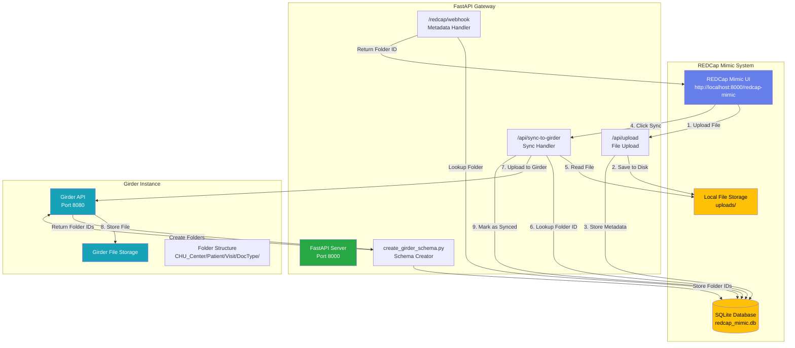
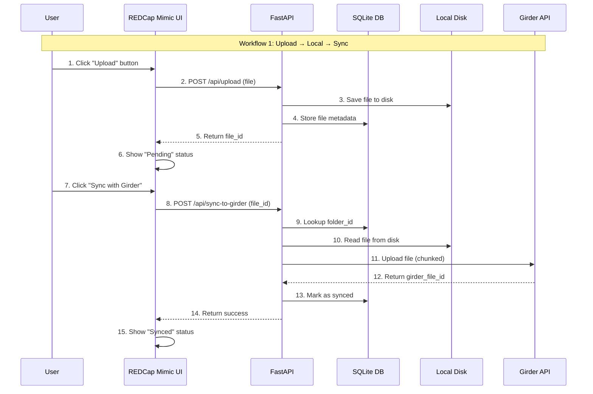
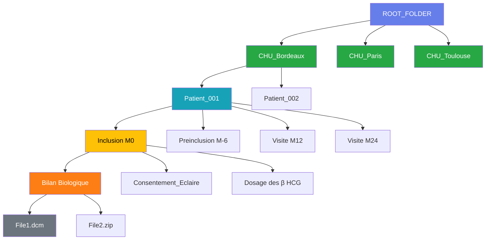
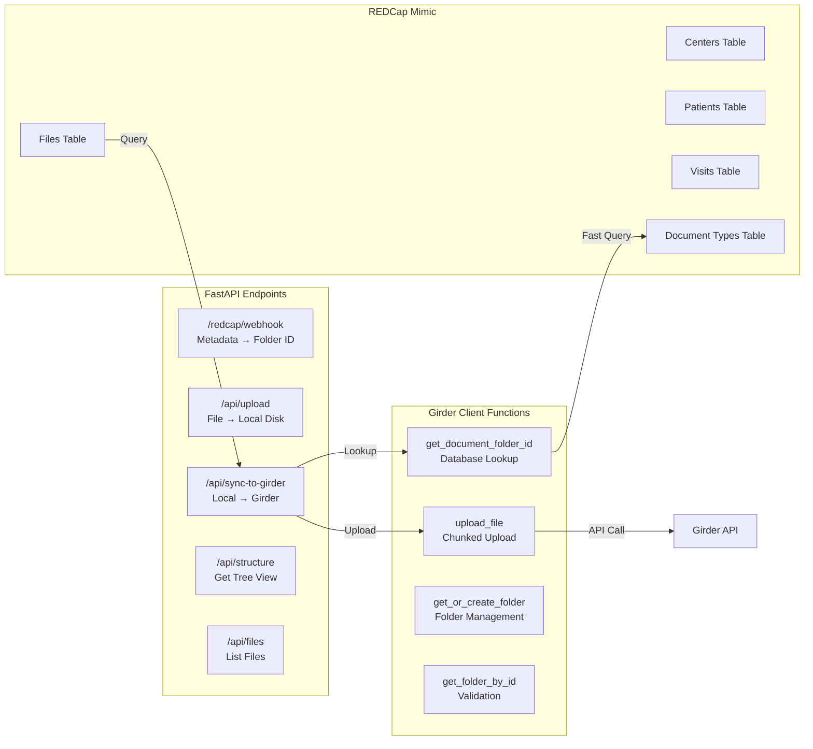
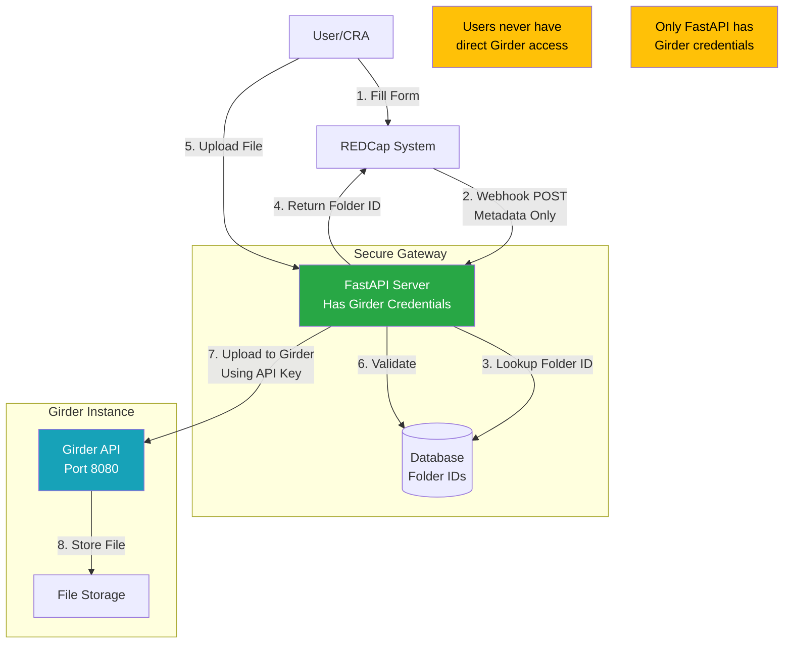
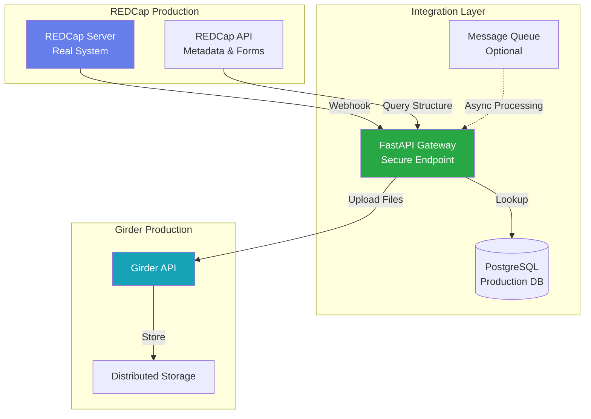

# REDCap-Girder Integration POC - Architecture Diagram

## System Architecture

## Data Flow - Upload & Sync Workflow

## Folder Structure in Girder

## Component Details

## Security Architecture

## Production Architecture (Future)

## Key Features

1. **Pre-populated Schema**: Folder structure created once in Girder
2. **Fast Lookups**: Database queries instead of API calls
3. **Secure Gateway**: Only FastAPI has Girder credentials
4. **Chunked Uploads**: Handles large files (ZIP, DICOM)
5. **Dual Workflow**: Upload→Sync (POC) and Direct Upload (Production-ready)
