# REDCap-Girder Integration POC - Simple Architecture

## Simple Overview

```mermaid
graph LR
    A["👤 User"] -->|"1. Upload File"| B["📱 REDCap Mimic<br/>Web Interface"]
    B -->|"2. Save File"| C["💾 Local Computer<br/>uploads/ folder"]
    B -->|"3. Store Info"| D["🗄️ Database<br/>SQLite"]
    
    A -->|"4. Click Sync"| B
    B -->|"5. Find Folder"| D
    B -->|"6. Upload File"| E["☁️ Girder<br/>File Storage"]
    
    style A fill:#667eea,color:#fff
    style B fill:#28a745,color:#fff
    style C fill:#ffc107,color:#000
    style D fill:#ffc107,color:#000
    style E fill:#17a2b8,color:#fff
```



## Step-by-Step Workflow


## What Goes Where

```mermaid
graph TD
    A["📁 Girder Storage"] --> B["CHU_Bordeaux"]
    B --> C["Patient_001"]
    C --> D["Inclusion M0"]
    D --> E["Bilan Biologique"]
    E --> F["📄 Your Files Here<br/>DICOM, ZIP, etc."]
    
    style A fill:#17a2b8,color:#fff
    style B fill:#28a745,color:#fff
    style C fill:#28a745,color:#fff
    style D fill:#ffc107,color:#000
    style E fill:#fd7e14,color:#fff
    style F fill:#6c757d,color:#fff
```



## The Three Main Parts


## Simple Explanation

### What We Built:
1. **REDCap Mimic** - A web page that looks like REDCap where users can upload files
2. **FastAPI Server** - The "middleman" that handles file uploads and syncing
3. **Girder** - Where files are finally stored in an organized folder structure

### How It Works:
1. User uploads a file → File saved on local computer
2. User clicks "Sync" → File copied to Girder
3. File appears in Girder in the correct folder

### Folder Structure in Girder:
```
CHU_Bordeaux/
  └── Patient_001/
      └── Inclusion M0/
          └── Bilan Biologique/
              └── Your files here
```

### Why This Matters:
- **REDCap** = Forms and metadata (patient info, visit dates, etc.)
- **Girder** = File storage (DICOM images, ZIP files, documents)
- **FastAPI** = Connects them together securely
